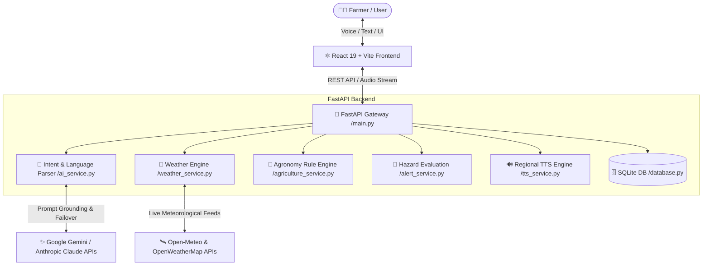

# 🌦️ WeatherGPT — SIH Problem Statement 68 (SIHPS68)

<div align="center">

[](https://fastapi.tiangolo.com/)
[](https://react.dev/)
[](https://tailwindcss.com/)
[](https://vitejs.dev/)
[](https://ai.google.dev/)
[](https://python.org)

**An Intelligent, Multilingual Conversational Weather & Agricultural Advisory Platform with Disaster Early Warning System**

[Key Features](#-key-features) • [Architecture](#-system-architecture) • [Getting Started](#-getting-started) • [API Documentation](#-api-endpoints) • [Tech Stack](#-technology-stack)

---

</div>

## 📌 Project Overview

**WeatherGPT (SIHPS68)** is an AI-driven meteorological intelligence and decision-support system built for farmers, disaster management authorities, and citizens. 

Standard conversational AIs often hallucinate live meteorological statistics (temperature, precipitation, wind speed). **WeatherGPT solves this through strict Grounded Generation Architecture**:
1. **Zero Hallucination Rule**: Numerical and observational weather metrics are fetched in real-time from high-resolution meteorological APIs (Open-Meteo sensor grids & OpenWeatherMap).
2. **AI Language Phrasing**: LLMs (Google Gemini / Anthropic Claude) and multilingual fallback engines translate ground-truth sensor data into natural, contextual advice in **12+ Indian regional languages**.
3. **Agri-Meteorological Guidance**: Generates crop-specific recommendations (irrigation schedules, spray windows, frost alerts) based on agronomic thresholds.
4. **IMD/WMO Standard Hazard Detection**: Automatically triggers alerts for thunderstorms, lightning, heavy rainfall (≥64.5 mm), heatwaves (≥40°C), severe gale winds, dense fog, and cold waves.

---

## 🌟 Key Features

### 1. 🤖 WeatherGPT Conversational Assistant
- **Multilingual Support**: Real-time queries and answers in English, Hindi, Bengali, Tamil, Telugu, Marathi, Gujarati, Kannada, Punjabi, Malayalam, Odia, and Urdu.
- **Voice & TTS**: Native text-to-speech engine with regional Indian accents and speech-to-text voice recognition for hands-free interactions.
- **Dynamic AI Fallback Matrix**: Intelligent failover hierarchy:
  $$\text{Gemini 3.6 Flash} \longrightarrow \text{Gemini 3.5 Flash} \longrightarrow \text{Claude 3.5} \longrightarrow \text{Multilingual Deterministic Rule Engine}$$

### 2. 🌾 Smart Agro-Advisory Engine
- **Crop-Specific Intelligence**: Real-time actionable insights for Wheat, Rice, Soybean, Cotton, Maize, Mustard, Pulses, and Vegetables.
- **Farming Decision Triggers**:
  - **Irrigation Planning**: Postpones irrigation during high rain probability to prevent waterlogging; advises irrigation during heatwaves and frost risks.
  - **Spray Windows**: Detects high wind speed (drift danger) and upcoming rain (wash-off risk) to prevent wasted chemical sprays.
  - **Disease & Pest Alerts**: Warns against high-humidity fungal outbreaks (rust, blight, yellow mosaic).

### 3. 🚨 Disaster Early Warning & Hazard Evaluation
- Evaluates real-time meteorological metrics against **IMD (India Meteorological Department)** and **WMO** criteria:
  - ⚡ **Thunderstorm & Lightning**: Live convective storm radar & WMO hazard codes (95, 96, 99).
  - 🌧️ **Heavy / Torrential Rainfall**: Rainfall rate $\ge 15\text{ mm/h}$ or 24h accumulation $\ge 64.5\text{ mm}$.
  - 🔥 **Heatwave / Severe Heat**: Temperature $\ge 40.0^\circ\text{C}$ (Plains) or $\ge 45.0^\circ\text{C}$.
  - 🌪️ **Gale / Squall Winds**: Wind speeds $\ge 50\text{ km/h}$ or gusts $\ge 65\text{ km/h}$.
  - 🌫️ **Low Visibility / Dense Fog**: Visibility $\le 1.0\text{ km}$.
  - ❄️ **Cold Wave**: Temperatures $\le 4.0^\circ\text{C}$.

### 4. 📊 Comprehensive Interactive Dashboard & Maps
- **Hyperlocal Metrics**: Live Temperature, Feels Like, Humidity, Wind Speed & Direction, UV Index, Air Pressure, Cloud Cover, Visibility, Dew Point, and Sunrise/Sunset times.
- **Hourly & 7-Day Forecasts**: Interactive trend charts for precipitation probability, temperature curves, and wind timelines.
- **Geospatial Weather Radar**: Map layers for temperature gradients, precipitation radar, and wind flows.
- **Admin & Query Analytics**: Query frequency tracking, regional interest distribution, and system health status.

---

## 🏗️ System Architecture



---

## 🛠️ Technology Stack

| Layer | Technologies |
| :--- | :--- |
| **Frontend** | React 19, Vite, Tailwind CSS v4, Lucide Icons, Modern Audio Web API |
| **Backend** | Python 3.10+, FastAPI, Uvicorn, Pydantic v2, HTTPX |
| **AI / NLP** | Google Gemini (gemini-3.6-flash, gemini-3.5-flash), Anthropic Claude, Rule-based NLU |
| **Speech / Audio** | Regional Multilingual TTS Synthesis, Web Speech API |
| **Weather Data** | Open-Meteo WMO Model (Primary, live sensor grid), OpenWeatherMap API |
| **Database** | SQLite3 (WAL mode enabled for concurrent queries) |

---

## 🚀 Getting Started

### Prerequisites
- **Node.js** (v18.0 or higher) & **npm**
- **Python** (v3.10 or higher)

### 1. Clone the Repository
```bash
git clone https://github.com/omm2808/SIHPS68.git
cd SIH2026/my-project
```

### 2. Configure Environment Variables
Create a `.env` file in the `my-project/` directory (or use the backend `.env`):

```env
# Operational Mode
DEMO_MODE=false

# Weather APIs (Open-Meteo works without keys; OpenWeatherMap optional key)
WEATHER_API_KEY=your_openweathermap_api_key

# LLM Providers (Google Gemini)
GEMINI_API_KEY=your_gemini_api_key
GEMINI_MODEL=gemini-3.6-flash

# Secondary LLM (Optional)
# ANTHROPIC_API_KEY=your_anthropic_api_key

# Backend Server Configuration
PORT=8000
```

---

### 3. Backend Setup & Run

#### In PowerShell (Windows):
```powershell
# Navigate to backend directory
cd backend

# Activate virtual environment
.\venv\Scripts\Activate.ps1

# (If needed) Install dependencies
pip install -r requirements.txt

# Start backend server
uvicorn main:app --reload --host 127.0.0.1 --port 8000
```

#### In Linux / macOS:
```bash
cd backend
source venv/bin/activate
pip install -r requirements.txt
uvicorn main:app --reload --host 127.0.0.1 --port 8000
```

Backend will be live at: **`http://127.0.0.1:8000`**  
Interactive Swagger API documentation: **`http://127.0.0.1:8000/docs`**

---

### 4. Frontend Setup & Run

In a separate terminal window:
```powershell
# From my-project directory
cd my-project

# Install NPM packages
npm install

# Start development server
npm run dev
```

Frontend will be running at: **`http://localhost:5173`**

---

## 📡 API Endpoints Summary

| Method | Endpoint | Description |
| :--- | :--- | :--- |
| `GET` | `/api/health` | System health check, active weather provider, and LLM status |
| `GET` | `/api/weather/current?location={city}` | Real-time weather observation and comprehensive metrics |
| `GET` | `/api/weather/forecast?location={city}&days=7` | 7-day extended weather forecast |
| `GET` | `/api/weather/hourly?location={city}&hours=12` | Hourly precipitation, temperature, and wind forecast |
| `POST` | `/api/chat` | WeatherGPT conversational query processor |
| `GET` | `/api/alerts?location={city}` | Real-time IMD/WMO meteorological hazard analysis |
| `POST` | `/api/agriculture/advisory` | Crop-specific weather advisory (Wheat, Rice, Cotton, etc.) |
| `GET` | `/api/tts?text={text}&lang={code}` | Generates audio stream (`audio/mpeg`) for regional speech |
| `GET` | `/api/admin/stats` | System audit statistics, popular locations, and query counts |

---

## 📂 Project Directory Structure

```text
SIH2026/
├── README.md                     # Main Project Documentation
└── my-project/
    ├── package.json              # Frontend dependencies and scripts
    ├── vite.config.js            # Vite configuration
    ├── .env                      # Environment configurations
    ├── backend/                  # FastAPI Application
    │   ├── main.py               # API Gateway & Route Definitions
    │   ├── ai_service.py         # LLM Grounding & Multilingual NLP Engine
    │   ├── weather_service.py    # Open-Meteo & OpenWeatherMap Connectors
    │   ├── agriculture_service.py# Crop Rules & Agronomic Advisory Engine
    │   ├── alert_service.py      # IMD/WMO Hazard Early Warning Engine
    │   ├── tts_service.py        # Regional Voice Synthesis Engine
    │   ├── database.py           # SQLite persistence layer
    │   ├── schemas.py            # Pydantic request & response models
    │   ├── requirements.txt      # Python dependencies
    │   └── weathergpt.db         # Persistent storage
    └── src/                      # React 19 Frontend
        ├── App.jsx               # Main Application Component
        ├── pages/                # Views (WeatherGPT, Agriculture, Alerts, Admin, etc.)
        ├── components/           # UI Components (Charts, MapView, WeatherCards, ChatWidget)
        ├── context/              # Global State (Weather, Language, Alerts)
        └── api/                  # Backend API Client handlers
```

---

## 👥 Team & Contribution

Developed for **Smart India Hackathon (SIH)** — **Problem Statement 68**.

Contributions, issue reports, and suggestions are welcome! Feel free to open an issue or submit a pull request.

---

<div align="center">
  <sub>Built with ❤️ for Indian Agriculture and Meteorological Disaster Resilience.</sub>
</div>
